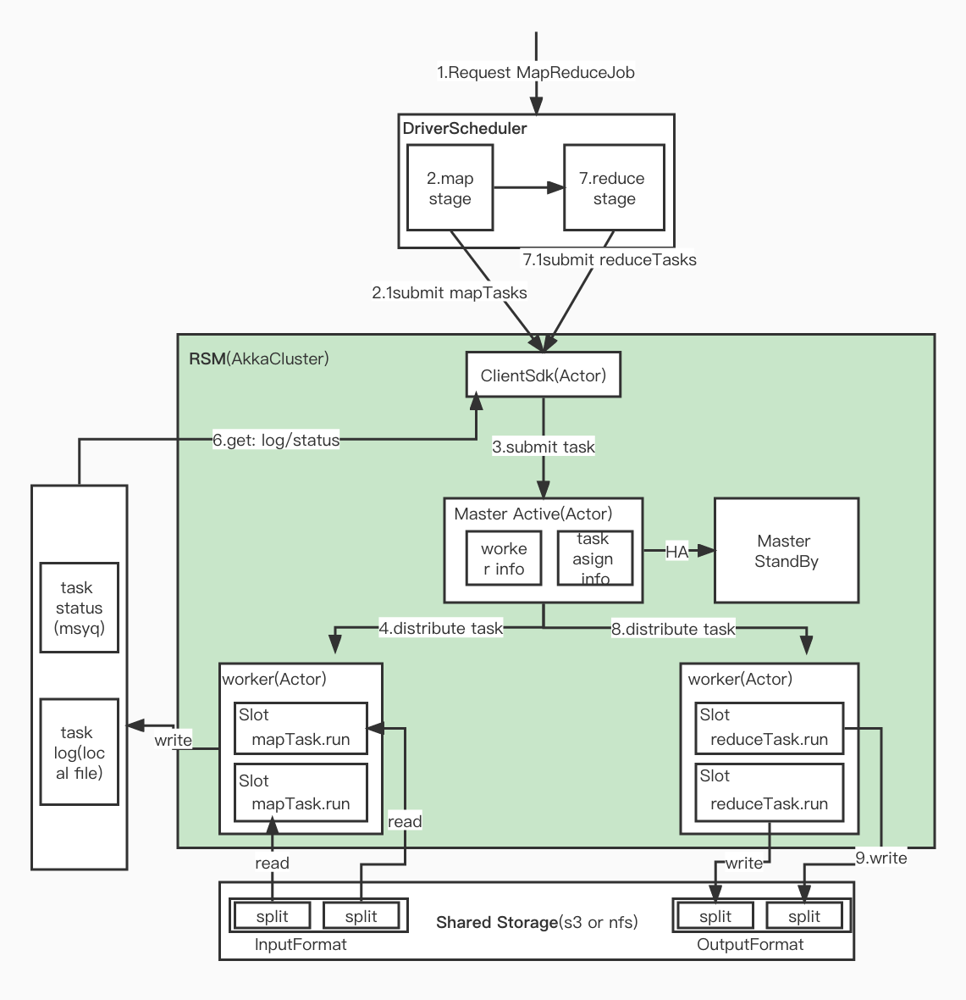

## Introduction
为了更直观的理解 MapReduce 的概念和执行流程,根据 Google MapReduce 和 Apache MapReduce 自己实现单机和分布式 (on yarn) MR 框架 

## Standalone

module: mapreduce-standalone

```
mapreduce-standalone/
└── src
    └── main
        └── java
            ├── dataformat  inputFormat/outputFormat
            ├── demo        examples by mapreduce-standalone
            ├── mapper      map interface
            ├── reducer     reduce interface
            └── schedule    main process
```

## On Yarn
ing...

## Distributed
doing

主要分2块:
1. DriverScheduler: 是mapreduce框架,负责调度map和reduce 2个阶段
2. RSM: 类似资源管理,采用Akka Cluster实现,负责调度和具体执行mapTask和ReduceTask的逻辑

